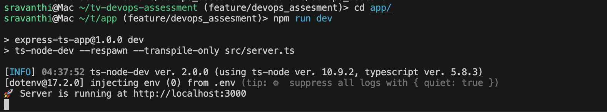
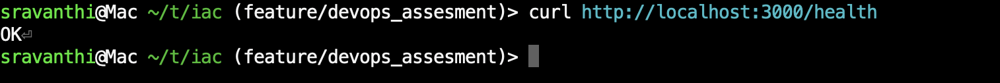

## Local Setup
1. cd tv-devops-assessment/app
2. Install dependencies: `npm install`
3. Start dev server: `npm run dev`
4. Test health endpoint: `curl http://localhost:3000/health`

## Docker Setup
1. Build and run: `docker compose up --build`
2. Test health endpoint: `curl http://localhost:3000/health`

## Local setup output

## CI/CD via GitHub Actions

CI Workflow (ci.yml)
       - Triggered on every pull request to main:

       - Builds and runs the app using Docker Compose

       - Verifies health check (/health)

       - Builds and pushes the Docker image to Amazon ECR

       - Tags the image using ${{ github.run_number }}

CD Workflow (cd.yml)
       - Triggered when a PR is merged into main:

       - Uses the image tag pushed from the CI workflow

       - Tags that image as latest and pushes to ECR

       - Updates the ECS service to use the new task definition

Both workflows can also be run manually with custom image tags via workflow_dispatch.

### GitHub Secrets Required

| Name                    | Description                       |
| ----------------------- | --------------------------------- |
| `AWS_ACCESS_KEY_ID`     | IAM User Access Key               |
| `AWS_SECRET_ACCESS_KEY` | IAM User Secret Key               |
| `AWS_REGION`            | e.g. `us-east-1`                  |
| `ECR_REPOSITORY`        | ECR repo name (e.g. `assessment`) |
| `ECR_REGISTRY`          | ECR registry URI                  |

