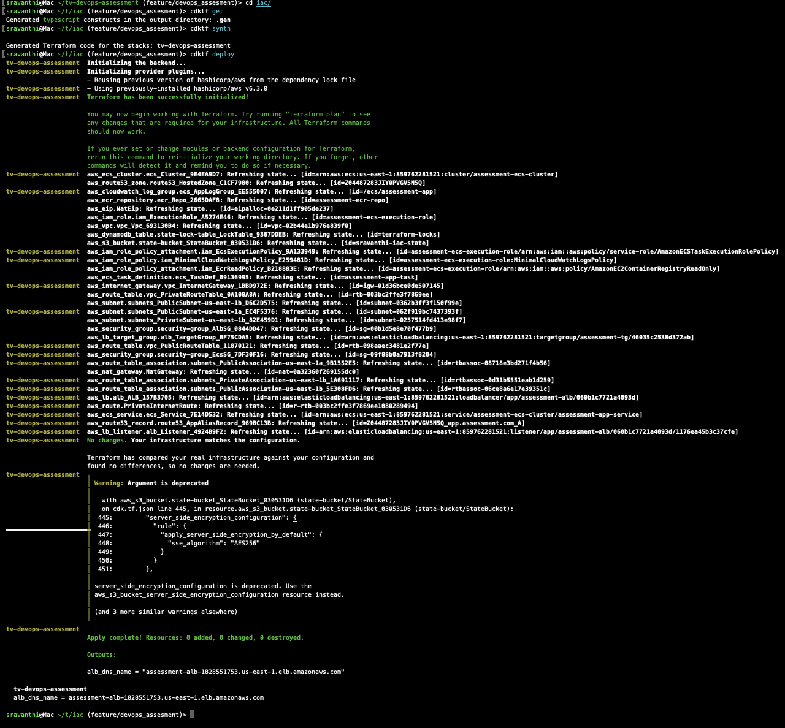
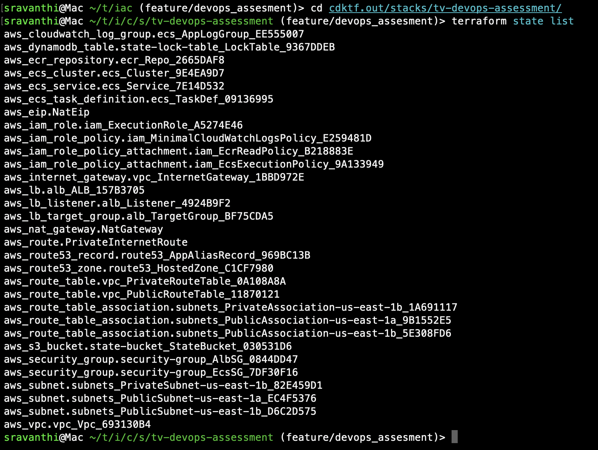
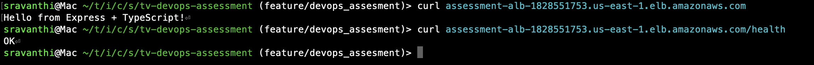

# 🚀 Infrastructure as Code – CDK for Terraform (CDKTF)

This directory provisions AWS infrastructure for the TurboVets DevOps Assessment using **CDK for Terraform**.

---

## 📦 What It Deploys

- VPC with public/private subnets
- Internet Gateway and NAT Gateway
- ECS Fargate cluster with your app
- Application Load Balancer (ALB)
- Route 53 DNS record (`app.DOMAIN_NAME`) // This is not registered
- ECR repository and IAM roles
- Remote Terraform state backend (S3 + DynamoDB)

---

## 🧰 Prerequisites

- ✅ AWS credentials set up (`aws configure` or env variables)
- ✅ Node.js (v18 or newer)
- ✅ CDKTF CLI installed globally:

```bash
npm install -g cdktf-cli

```

- A .env file to customize deployment settings 
- Update the .env file with environment-specific values:

| Variable                 | Description                                |
| ------------------------ | ------------------------------------------ |
| `AWS_REGION`             | AWS region to deploy to (e.g. `us-east-1`) |
| `DOMAIN_NAME`            | Root DNS zone for Route53                  |
| `BACKEND_BUCKET`         | S3 bucket for Terraform state              |
| `BACKEND_KEY`            | S3 object key for storing state            |
| `BACKEND_REGION`         | AWS region where state bucket is hosted    |
| `BACKEND_DYNAMODB_TABLE` | DynamoDB table for state locking           |
| `VPC_CIDR`               | Main VPC CIDR block                        |
| `PUBLIC_SUBNET_CIDRS`    | Comma-separated public subnet CIDRs        |
| `PRIVATE_SUBNET_CIDRS`   | Comma-separated private subnet CIDRs       |
| `PUBLIC_SUBNET_ZONES`    | Comma-separated AZs for public subnets     |
| `PRIVATE_SUBNET_ZONES`   | Comma-separated AZs for private subnets    |
| `IMAGE_TAG`              | image tag of ecs service                   |

## Setup Instructions

cd iac/

### Create a local .env file from the example
cp .env.example .env

### Install required dependencies
npm install

### Load environment variables (if not using dotenv-cli)
export $(cat .env | xargs)

## Deploy Infrastructure to AWS

### Generate provider bindings
cdktf get

### Synthesize Terraform JSON config
cdktf synth

### Deploy to AWS
cdktf deploy



No infrastructure changes were required during this cdktf deploy run since the stack was already deployed. The output includes the alb_dns_name, which can be used to validate the /health endpoint.


## Validate the App

After deployment, validate the app is running:
    ALB DNS output:
        `curl http://assessment-alb-1828551753.us-east-1.elb.amazonaws.com/health`

    Route 53 DNS (if configured):
        `curl http://app.${DOMAIN_NAME}`



## Multi-Environment Setup (Optional)

This project can be easily extended to support multiple environments like `dev`, `staging`, and `prod`.

➡️ Refer to multiple-env-set.md for a complete guide on setting up multiple stacks and isolated state files using CDKTF.


